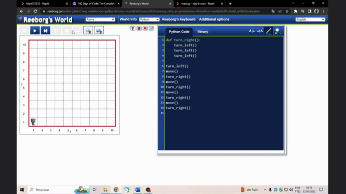
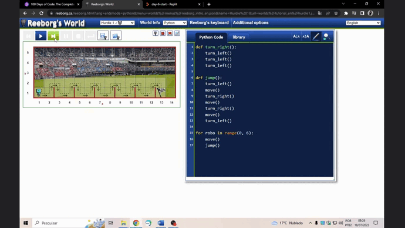
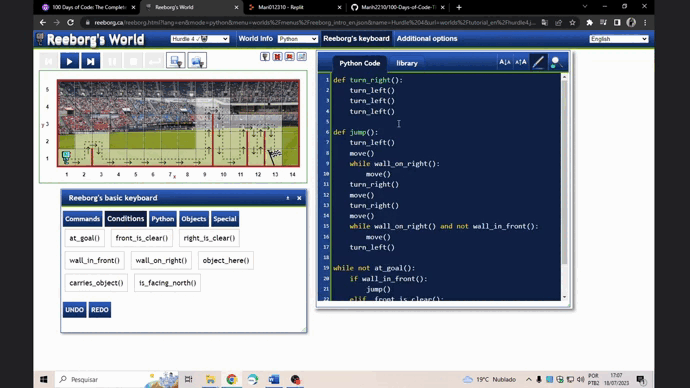

Challenge Day06 - Desenvolver um código capaz de resolver os 4 problemas do labirinto do rôbo:  
  

Exercício 01 - Desenhar um quadrado com o rôbo:  
  

Exercício 02 - Chegar até a linha de chegada:  
  

Exercício 03 - Encontrar a bandeira aleatória:  
  

Exercício 04 - Paredes aleatórias:  
  

Exercício 05 - Paredes aleatórias com alturas aleatórias:  
  

